# RL+ GridWorld Pipeline

## 1. Assignment

Environment:
- Grid size: `10x10`.
- Number of states: `100`.
- Forbidden states (obstacles): `10` random states.
- Goal state: random state not in obstacles.
- Actions: Up, Down, Left, Right.
- Transition rule for obstacles: moving into obstacle keeps agent in place.

---

## 2. Environment Definition
Let:
- `S = {0, ..., 99}` be states,
- `A = {0,1,2,3}` be actions,
- `G` be the goal state,
- `O ? S` be obstacle states (`|O|=10`).

Rewards:
- `r(s) = -1` for non-goal states,
- `r(G) = 0`.

Transitions:
- If `s = G`, then `s' = G` (absorbing goal).
- If `s ? O`, then `s' = s` (absorbing obstacle row for consistency).
- If action leads to obstacle, then `s' = s`.
- Otherwise, move by action with boundary clipping.

Obstacle generation constraint:
- Obstacles are resampled until all free states can reach the goal under environment dynamics.

---

## 3. Theory (with formulas)

### 3.1 Policy-induced transition matrix
\[
P[s,s'] = \sum_{a \in A} \pi(a \mid s)\,\mathbf{1}\{\text{step}(s,a)=s'\}
\]

### 3.2 Bellman expectation update for value function
\[
V_{k+1}(s) = r(s) + \gamma \sum_{s'} P[s,s']V_k(s')
\]
Vector form:
\[
\mathbf{V}_{k+1} = \mathbf{r} + \gamma P\mathbf{V}_k
\]

### 3.3 Action-value update
For deterministic per-action matrix \(P_a\):
$$
Q_{k+1}(s,a) = r(s) + \gamma \sum_{s'} P_a[s,s']V_k(s')
$$

### 3.4 Policy projection from Q
$$
V(s)=\sum_{a\in A}\pi(a\mid s)Q(s,a)
$$

### 3.5 Greedy + soft policy improvement
Greedy policy:
$$
\pi_{\text{greedy}}(a\mid s)=\mathbf{1}\{a=\arg\max_{a'}Q(s,a')\}
$$
Soft update:
$$
\pi_{new}=(1-\tau)\pi_{old}+\tau\pi_{\text{greedy}}
$$

---

## 4. Results (current run)
Run was executed with seed `42`.

### 4.1 Environment and obstacles
- Goal state: `8`
- Obstacles: `[9, 10, 20, 41, 53, 60, 67, 70, 81, 93]`

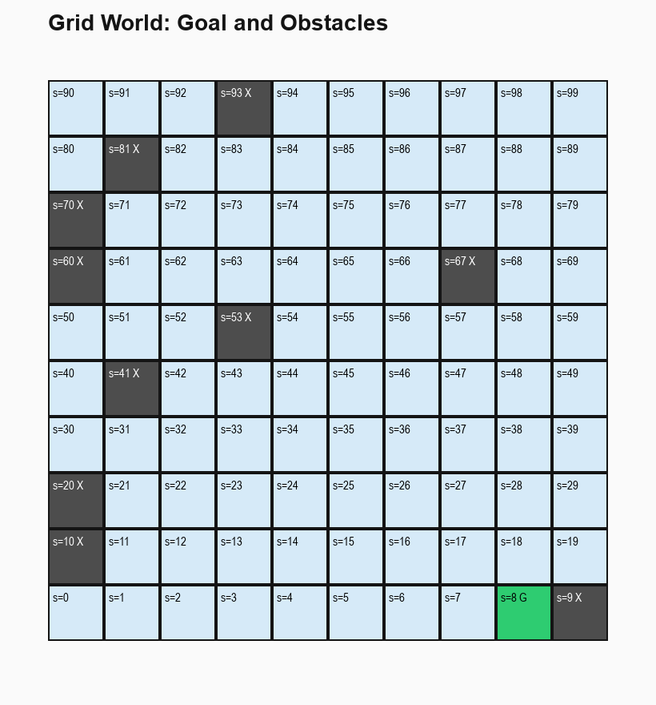
*Figure 1. 10x10 grid with goal (`G`) and forbidden obstacle states (`X`).*

### 4.2 Dynamics and policy sampling diagnostics
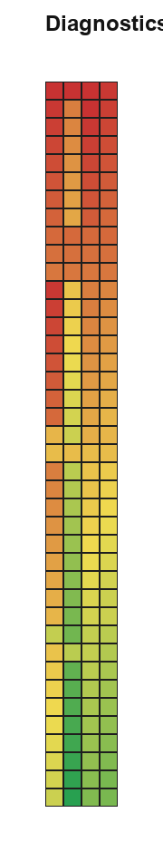
*Figure 2. Deterministic next-state index for each `(state, action)` pair.*

### 4.3 Example trajectories under initial policy
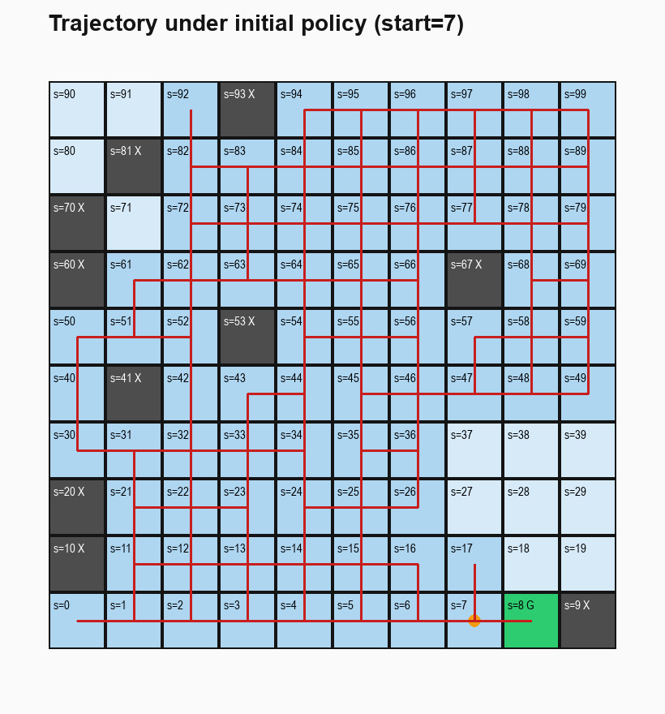
*Figure 3. Example rollout from a free start state under initial random policy.*

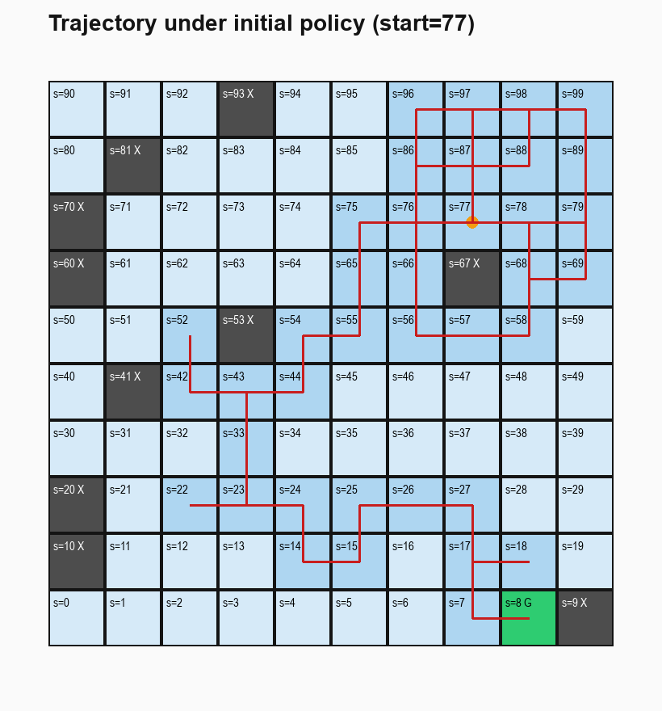
*Figure 4. Another initial-policy rollout (obstacles and blocked moves visible).*

### 4.4 Value-function analysis
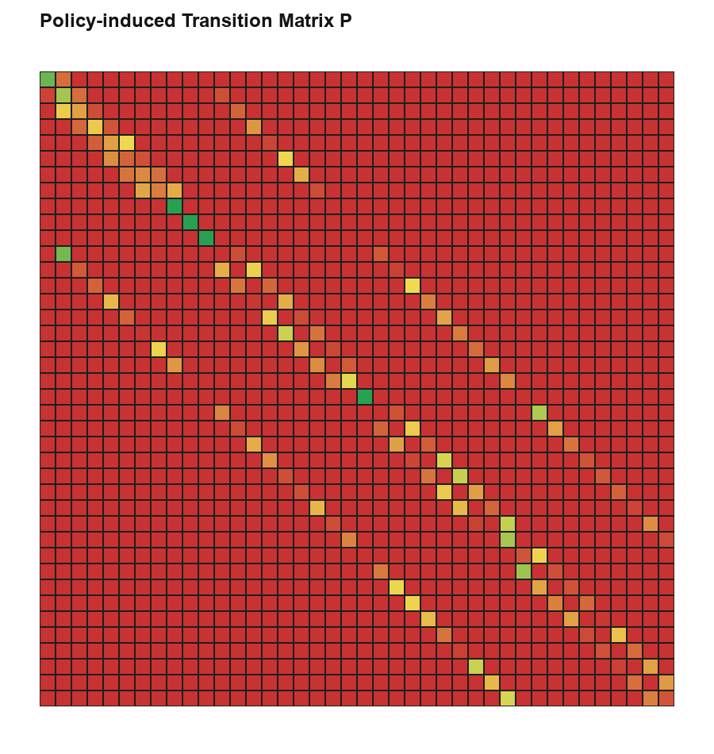
*Figure 5. Policy-induced transition matrix heatmap (cropped view for readability).* 

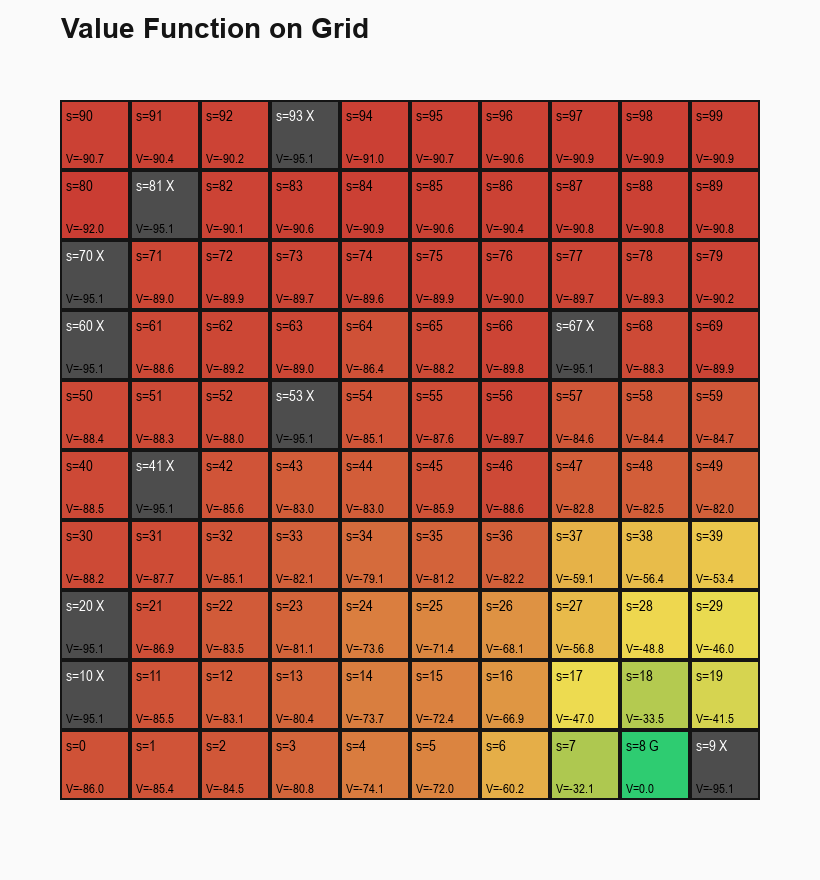
*Figure 6. Value function projected onto grid cells.*

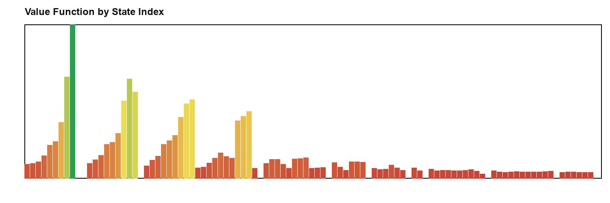
*Figure 7. Flat state-index view of `V(s)`; obstacle bars highlighted in gray.*

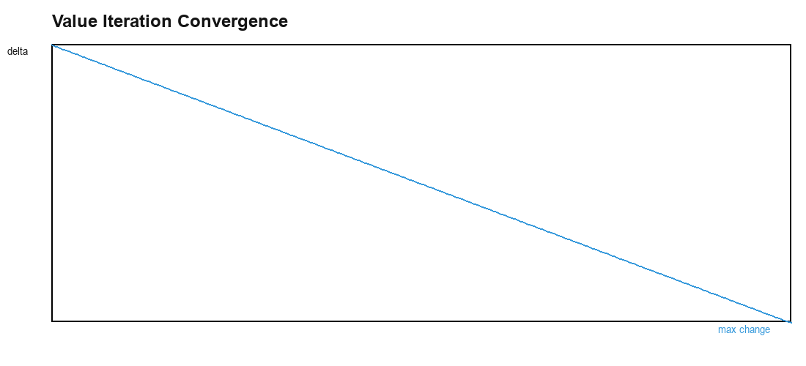
*Figure 8. Value iteration convergence trend (`max |?V|`).*

### 4.5 Q-function and greedy policy
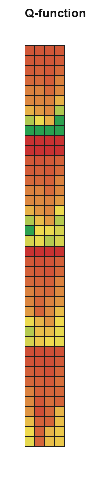
*Figure 9. Q-function heatmap over states and actions.*

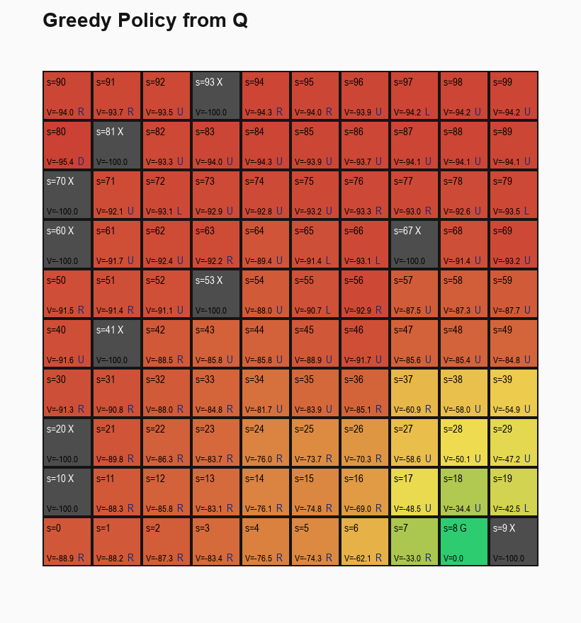
*Figure 10. Greedy policy directions derived from `argmax_a Q(s,a)`.*

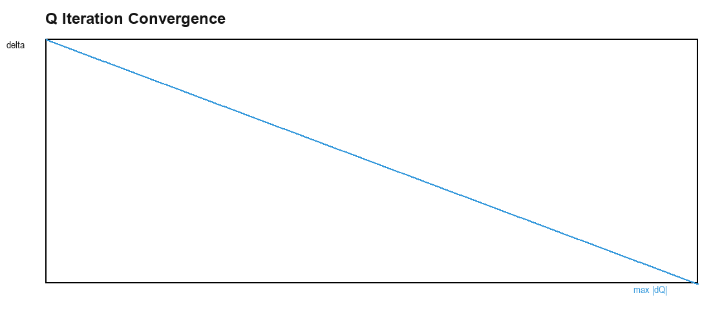
*Figure 11. Q-iteration convergence (`max |?Q|`).*

### 4.6 Policy improvement
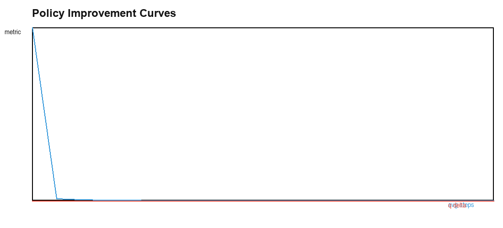
*Figure 12. Soft policy-improvement curves (average steps and convergence metric).* 

Current run metrics:
- `avg_steps_random = 694.5`
- `avg_steps_improved = 6.0`
- Improved policy not worse: `True`

### 4.7 Final comparison board
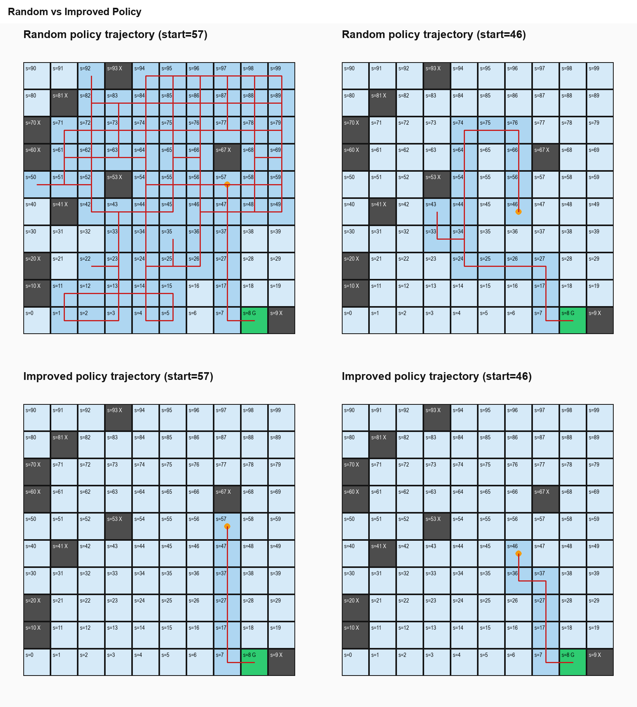
*Figure 13. Side-by-side trajectory comparison: random vs improved policy.*

---

## 5. Reproducibility

### 5.1 Install dependencies
```bash
pip install -r requirements.txt
```

### 5.2 Run stage-by-stage
```bash
python -m src.run_stage --stage env
python -m src.run_stage --stage dynamics
python -m src.run_stage --stage episodes
python -m src.run_stage --stage value
python -m src.run_stage --stage q
python -m src.run_stage --stage improve
python -m src.run_stage --stage compare
```

### 5.3 Run full pipeline
```bash
python -m src.run_stage --stage all --results-dir results
```

Optional:
```bash
python -m src.run_stage --stage all --results-dir results --seed 42
```

### 5.4 Validate generated artifacts
```bash
python -m src.validate_results --results-dir results
```

### 5.5 Output structure
- `results/data/`: env, policies, `P`, `V`, `Q`, summaries (`*.json`, `*.npy`)
- `results/tables/`: detailed CSV tables
- `results/figures/<stage>/`: all PNG visuals generated via pygame

---

## 6. Script Interface Summary
- `python -m src.run_stage --stage env`
- `python -m src.run_stage --stage dynamics`
- `python -m src.run_stage --stage episodes`
- `python -m src.run_stage --stage value`
- `python -m src.run_stage --stage q`
- `python -m src.run_stage --stage improve`
- `python -m src.run_stage --stage compare`
- `python -m src.run_stage --stage all`

Common args:
- `--results-dir` (default: `results`)
- `--seed` (default from stage env config, currently `42`)
